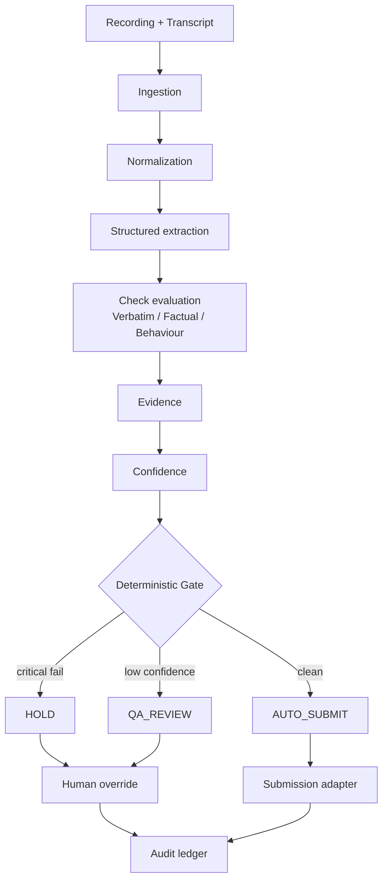

# VerityGate — AI Sales QA Decisioning

Evidence-backed AI quality gate for pre-submission sales QA. Built for the **CIMET AI Hiring Hackathon 2026**.

**What is this?** A quality gate that sits between a completed sales call and CRM submission — it scores the call against a retailer's checklist and decides `AUTO_SUBMIT`, `HOLD`, or `QA_REVIEW` before the sale is allowed through.

**What problem does it solve?** Manual QA requires an auditor to listen through a call, compare it against a retailer-specific checklist, and decide whether the sale can proceed. That doesn't scale, and it's inconsistent between auditors.

**Why is the architecture trustworthy?** The gate decision is a pure, deterministic function of check results — never an LLM call. Every result carries a transcript quote, a timestamp, a confidence value, and the rule version that was live on the call date. See [Why this architecture](#why-this-architecture) below.

**How do I run it?** [Run locally](#run-locally).

**Where is the demo?** [5-minute demo](#5-minute-demo), with real lead IDs from the current seed.

> Prototype developed for CIMET's QA Automation challenge — not an official CIMET product. All data is synthetic. See [Hackathon disclosure](#hackathon--development-context).

---

## Executive summary

Manual sales QA today: an auditor listens through a recorded call, checks it against a retailer's compliance checklist (disclosure read verbatim, rate confirmed, address matches CRM, etc.), and decides whether the sale is clean enough to submit. This is slow, inconsistent, and doesn't scale past a small team.

**VerityGate** replaces that manual pass with an evidence-backed evaluation and gating layer:

```
Recording / Transcript → Normalization → Structured extraction → Check evaluation
  → Evidence → Confidence → Deterministic gate → Submission / Hold / QA Review
  → Human override → Audit / Calibration
```

Every decision is explainable: which check failed, what the transcript actually said, what it should have said, and which rule version was in force on the call date.

## Why this architecture

This is deliberately **not** "an LLM reads the transcript and says PASS/FAIL." That approach can't be audited, can't be trusted for a compliance decision, and fails silently when the model is wrong. Instead:

| Concern | Approach |
|---|---|
| Critical compliance (12 of 20 checks) | 100% deterministic — text similarity, regex extraction, or value comparison against CRM/rate-card data. Never touched by AI. |
| Semantic behaviour (rapport, interruptions, objection handling) | Deterministic transcript-derived signal first, with an *optional* AI semantic layer that can corroborate or flag disagreement — never override. |
| Final gate decision | A pure function (`criticalFails > 0 → HOLD`; `any confidence < floor → QA_REVIEW`; else `AUTO_SUBMIT`). Unit-tested exhaustively. Never produced by a model. |
| Genuine uncertainty | Routed to a human (`QA_REVIEW`), never silently auto-passed. |

This is the central engineering decision behind the whole system: **AI augments evidence quality on non-critical signals; it never makes the compliance decision.**

## Core capabilities

- 20-check evaluation framework across 3 check types (Verbatim, Factual, Behaviour) — see `docs/CHECK_AUDIT.md` for the full per-check audit
- Evidence extraction with transcript quote, speaker, timestamp, and confidence on every result
- Confidence-aware routing: any check below the confidence floor routes to human review, never a silent pass
- Deterministic gate: `AUTO_SUBMIT` / `HOLD` / `QA_REVIEW`
- Real audio playback, seeked to the evidence timestamp (synthetic demo recordings — see [Limitations](#limitations))
- Human override — appended alongside the AI decision, never replacing it
- Append-adjacent audit ledger with full call lineage
- Historical rule-version resolution (a call resolves to the checklist version live on its call date)
- Calibration dashboard (AI/human agreement, confidence distribution, disagreement categories) — synthetic demo data
- Repeat-offence detection (3+ failures of the same critical check in a rolling 7-day window)
- Card-number redaction before storage and before playback
- Pluggable adapters: ingestion, ASR, submission, sandbox, AI provider — each has a real interface and a working mock/demo implementation; none hard-codes a vendor

## The three check types

| Type | Purpose | Example | Criticality | Evaluation strategy |
|---|---|---|---|---|
| **Verbatim** | Approved script comparison | Recording disclaimer, DMO read, T&Cs, cooling-off rights | Mostly critical | Normalized text-similarity vs. the approved phrase |
| **Factual** | Transcript vs. CRM / retailer source | Address, DOB, rate card, email, NMI | Mixed | Regex extraction + tolerance comparison against `crm_snapshot` / rate card |
| **Behaviour** | Conversation quality signals | Dead air, rapport, interruptions, objection handling | Never critical | Deterministic transcript heuristics (talk-time share, timestamp overlap, objection-language detection), optionally corroborated by AI |

Critical Verbatim/Factual failures can **block** the sale (`HOLD`). Behaviour checks never block — they route to `QA_REVIEW` only on low confidence, and otherwise surface as coaching notes.

## Decision model

```
critical check FAILs > 0        → HOLD
any check's confidence < floor  → QA_REVIEW   (checked only when no critical fail)
otherwise                       → AUTO_SUBMIT → Submission adapter → Submission record
```

`HOLD` and `QA_REVIEW` never reach the submission adapter — this is enforced in code (`submit_if_auto_submitted` raises if the decision isn't `AUTO_SUBMIT`), not just by convention. The backend is the sole authority on the gate: the frontend (`gateForLead()`) only ever displays `lead.decision` as returned by the API — it never recomputes the gate client-side on the live data path.

## Evidence model

Every `CheckResult` carries:

- `observed` / `expected` values
- `sourceOfTruth` (which rule/CRM field it was checked against)
- a transcript evidence quote
- speaker and timestamp
- a confidence value
- the rule version it was evaluated under
- a plain-language rationale

This is what makes a `HOLD` decision auditable rather than opaque — a reviewer (or a jury) can see exactly what failed and why.

## Rule versioning

```
Retailer → Checklist → RuleVersion (effective_from date) → Checks
```

A call resolves to the **rule version that was live on the call's date**, not the current one — so re-running an old call doesn't silently re-score it against today's rules. This is the prototype's production-oriented design, not a claim of CIMET's actual production rule-versioning system.

## Human in the loop

- The AI decision is **never mutated or hidden** by a human override.
- A human override is stored as a separate `HumanReview` record alongside the AI decision.
- Every override writes an `AuditEvent` — visible in the audit ledger.
- The system reports what failed and where; it does not rewrite the sale, correct the agent, or contact the customer.

## Calibration

The calibration view reports AI/human agreement rate, override counts, critical false-pass/false-fail rates, confidence distribution, disagreement categories, and repeat offences — computed from **~300 bulk synthetic backfill leads** generated at seed time, clearly separate from the 9 named demo scenarios. This is **synthetic demo data**, never CIMET production results.

## Security / guardrails

- Synthetic test data only — no real customer PII anywhere in dev, demo, or test
- Card numbers are redacted before storage and before playback (`redact_card_numbers`)
- Consent/disclosure is enforced as a first-class critical check, not an afterthought
- The system never gives advice, never auto-corrects the agent, never contacts the customer
- Low confidence can never silently auto-pass — it always routes to a human
- `ANTHROPIC_API_KEY` (and `BACKEND_URL`) are backend-only environment variables — never shipped to the browser
- API errors return safe messages; no stack traces, file paths, or credentials are exposed to clients

## AI architecture

```
Transcript
  ↓
Deterministic signals (talk-time share, timestamp overlap, objection-language match)
  ↓
   + optional AI semantic layer (rapport / interruptions / objection handling ONLY)
  ↓
Structured, schema-validated evaluation (Pydantic)
  ↓
Evidence (verified against real transcript segments — a citation to a
           quote/segment that doesn't exist is discarded, not trusted)
  ↓
Confidence (agreement between deterministic + AI averages; disagreement
             lowers confidence but never flips status)
  ↓
Deterministic Gate (never touched by the AI layer)
```

The LLM is **structurally unable** to:
- see or touch a critical check
- override the gate decision
- change CRM data or retailer rules
- change which rule version is in force
- invent a transcript quote or segment id (evidence is verified before it's trusted at all)

`AI_PROVIDER=none` is the default and is what the live demo actually runs on — this build never requires external credentials to function completely and correctly. If `AI_PROVIDER=anthropic` and `ANTHROPIC_API_KEY` are set, exactly **one** contextual Anthropic call per lead evaluates all three eligible behaviour metrics together (not one call per check). Any provider failure — timeout, malformed JSON, schema violation, unverifiable evidence — degrades safely to the deterministic result; it never crashes and never produces a fabricated pass. See `docs/CHECK_AUDIT.md` and `backend/app/services/ai_behaviour.py`.

**Important:** the current default demo configuration performs zero external AI calls. The safety-fallback path was verified with `AI_PROVIDER=anthropic` configured against an invalid key (confirmed to fall back to the deterministic result — see `docs/DEMO.md`); no live, credentialed Anthropic call has been run in this environment, since no key was available. Stated plainly rather than implied.

## Technology stack

| Layer | Technology |
|---|---|
| Frontend | Next.js 16 (App Router), TypeScript (strict), Tailwind CSS v4, Radix UI, Vitest, Playwright |
| Backend | Python 3.14, FastAPI, SQLAlchemy 2.0, Pydantic v2, SQLite, pytest |
| AI provider abstraction | A small `LLMProvider` Protocol (`app/services/ai_provider.py`) — `NullLLMProvider` (default) and `AnthropicLLMProvider` (opt-in). No agent framework, no LangChain/LangGraph/PydanticAI/LlamaIndex — a single structured-extraction call behind an interface. |
| Optional AI model | `claude-sonnet-5` via the official `anthropic` Python SDK |

## Run locally

```bash
# Backend
cd backend
python3 -m venv .venv && source .venv/bin/activate
pip install -r requirements.txt
python -m app.seed 300          # deterministic seed/reset — 9 named scenarios + ~300 bulk synthetic leads
uvicorn app.main:app --reload --port 8000

# Frontend (separate terminal, repo root)
pnpm install
pnpm dev -p 3001
```

Then open `http://localhost:3001`.

**Tests / checks:**

```bash
# Backend
cd backend && python -m pytest -q

# Frontend
pnpm typecheck
pnpm lint
pnpm test           # Vitest — gate logic unit tests
pnpm build           # production build
pnpm test:e2e         # Playwright — full demo flow against a real backend
```

## 5-minute demo

All IDs below are from the current seed (`python -m app.seed 300`) and were verified live in this environment.

| # | Scenario | Lead ID | Open | What the judge sees | What to say |
|---|---|---|---|---|---|
| 1 | **Clean → auto-submit** | `3613742` | `/sales/3613742` | `AUTO-SUBMIT`, all critical checks pass, a real `Submission` record (labeled `DEMO_MOCK`) | "Nothing blocks this — it goes straight through, and the submission is a real persisted record, not a UI toggle." |
| 2 | **Worked example → HOLD** | `3613790` | `/sales/3613790` | Rate mismatch (28.6c vs 31.9c/kWh) and email mismatch, both critical FAIL → `HOLD` | Click "Play evidence" on the rate finding — real audio seeks to 14:02 and plays. |
| 3 | **Low confidence → QA review** | `3613811` | `/sales/3613811` | `QA_REVIEW`, reason states insufficient confidence, **not submitted** | "Uncertainty never auto-passes — it goes to a human." |
| 4 | **Behaviour signal** | `3613824` | `/sales/3613824` | Real transcript-derived rapport/objection-handling evidence (not a silent pass) | Open the Objection handling check — the evidence quote is the actual customer pushback line. |
| 5 | **Human override** | `3613766` | `/sales/3613766` → `/audit/3613766` | AI decision (HOLD) still visible, human override (PASS) stored separately, audit event | "The AI decision is never erased — the human decision sits alongside it." |
| 6 | **Audit / calibration** | — | `/audit/3613766`, `/calibration` | Full call lineage; agreement rate / confidence distribution on synthetic bulk data | Label calibration numbers as synthetic demo data, not CIMET results. |

**What not to claim:** that a real Anthropic call ran in this session (it didn't — no key was available), or that the calibration numbers are real CIMET performance data (they're synthetic).

### Worked example detail (lead `3613790`)

| Check | Status | Observed | Expected |
|---|---|---|---|
| Rates and charges | **FAIL** | `28.6c / kWh peak` | `31.9c / kWh peak` |
| Email captured | **FAIL** | `j.smith@gmial.com` | `j.smith@gmail.com` |

Two critical failures → `HOLD`. Every other critical check (disclaimer, account holder, DMO) passes with a transcript quote, timestamp, and rule version attached.

## Architecture diagram



## API overview

| Method | Endpoint | Purpose |
|---|---|---|
| GET | `/api/health` | Backend/DB/AI-provider/recording capability status |
| GET | `/api/leads` | List leads (filterable) |
| GET | `/api/leads/{id}` | Full lead detail (results, transcript, decision, submission) |
| GET | `/api/leads/{id}/checks` | Check results only |
| GET | `/api/leads/{id}/evidence` | Evidence detail |
| GET | `/api/leads/{id}/timeline` | Call timeline |
| GET | `/api/leads/{id}/audio` | Real WAV audio bytes, Range-request seekable |
| GET | `/api/leads/{id}/submission` | Submission record, if any |
| POST | `/api/evaluations` | Run the real evaluation pipeline for a lead |
| GET | `/api/evaluations/{id}` | Fetch a persisted evaluation by id |
| POST | `/api/reviews` | Submit a human override |
| POST | `/api/leads/{id}/override` | Submit a human override (lead-scoped) |
| GET | `/api/rules` | Rule sets / versions |
| GET | `/api/rules/{id}` | One rule version |
| GET | `/api/checks` | Check catalogue |
| GET | `/api/dashboard` | Dashboard KPIs |
| GET | `/api/calibration` | Calibration metrics |
| GET | `/api/audit/{leadId}` | Audit ledger for a lead |

## Data model

`Retailer → Checklist → RuleVersion → Check`, and independently `Lead → Recording → Transcript → TranscriptSegment`. Evaluating a lead produces `CheckResult` (+ `Evidence`) rows and one `GateDecision`, which — only on `AUTO_SUBMIT` — produces a `Submission`. `HumanReview` and `AuditEvent` are additive records layered on top; `CalibrationSample` backs the calibration dashboard.

## Testing

Current verified results in this environment:

- Backend: `python -m pytest -q` → **138 passed**
- Frontend unit: `pnpm test` → **20 passed** (gate-logic Vitest suite)
- TypeScript: `pnpm typecheck` → clean
- Lint: `pnpm lint` → clean
- Build: `pnpm build` → succeeds, all 9 routes compile
- E2E: `pnpm test:e2e` → **4 passed** (full demo flow, real backend re-evaluation trigger, real audio playback, backend-sourced transcript)

## Limitations

Stated plainly, as known prototype boundaries — not production claims:

- Only one checklist export is available (Retailer 1, Energy, v1.4); other retailer/product rule sets in the UI are illustrative navigation, not independently verified checklists.
- `CheckResult` / `Evidence` / `GateDecision` / `Submission` reflect the latest evaluation of a lead rather than a full version history — the `AuditEvent` ledger is the permanent, append-only record of everything that happened (see `docs/ARCHITECTURE.md` for the detail).
- Audio is **synthetic demo audio** (a speaker-distinguishable tone generated from real seeded turn timings), not a real call recording, and is only generated for the 9 named demo leads.
- ASR and CIMET sandbox/dialler integration are visible, real interfaces (`ASRProvider`, `CIMETSandboxAdapter`, `CIMETASRAdapter`) ready for a real vendor — see `docs/INTEGRATION.md` for exactly what's implemented vs. pending.
- The optional AI layer's plumbing is verified end-to-end (schema validation, evidence verification, safe fallback); it has not yet been exercised against a live, credentialed Anthropic call in this environment.
- Calibration metrics are computed from synthetic bulk data, not real call volume.

## Hackathon / development context

- Built for the **CIMET AI Hiring Hackathon 2026**, run through HackCulture.
- Uses synthetic/test data throughout — no proprietary CIMET production data is included anywhere in this repository.
- Open-source libraries are used as listed in [Technology stack](#technology-stack); this repository does not claim original ownership of any third-party library.
- AI-assisted development tools (Claude Code) were used during implementation.
- "VerityGate" is a prototype name for this submission — it does not imply an official CIMET product or endorsement.

## Documentation

- [`docs/ARCHITECTURE.md`](docs/ARCHITECTURE.md) — system components, data flow, security considerations
- [`docs/DEMO.md`](docs/DEMO.md) — exact demo script and reset commands
- [`docs/INTEGRATION.md`](docs/INTEGRATION.md) — what's real vs. a demo adapter vs. not yet available
- [`docs/CHECK_AUDIT.md`](docs/CHECK_AUDIT.md) — full audit of all 20 checks
- [`docs/DECISIONS.md`](docs/DECISIONS.md) — every unspecified tolerance/weight/floor and why it was chosen
